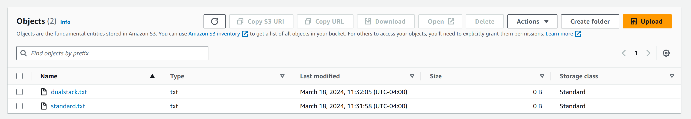

## S3 URL Endpoints
view all: https://docs.aws.amazon.com/general/latest/gr/s3.html

### Create a Bucket
```sh
aws s3 mb s3://endpoint-test-ml-123
```
### Upload a file to S3 using standard endpoint
```sh
touch standard.txt
aws s3 cp standard.txt s3://endpoint-test-ml-123 --endpoint-url https://s3.us-east-1.amazonaws.com
```
### Upload a file to S3 using dualstack endpoint
```sh
touch dualstack.txt
aws s3 cp dualstack.txt s3://endpoint-test-ml-123 --endpoint-url https://s3.dualstack.us-east-1.amazonaws.com
```

### Results


## Cleanup
```sh
aws s3 rm s3://endpoint-test-ml-123/standard.txt
aws s3 rm s3://endpoint-test-ml-123/dualstack.txt
aws s3 rb s3://endpoint-test-ml-123
```