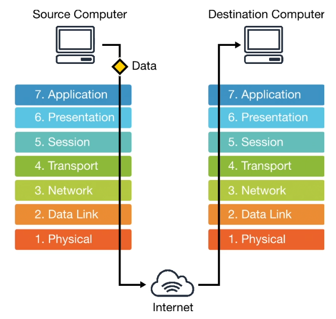

# Cloud Networking
id:: 68823739-09c9-4ed1-9560-243f82927f52
	- ## Open Systems Interconnection (OSI) Model
	  collapsed:: true
		- The OSI model describes how information moves through a network from one computer to the next.
		- [[img]] | OSI Process Flow
		  collapsed:: true
			- 
		- ---
		- ### History
		  collapsed:: true
			- 1970 | OSI Invented
				- Organizations and governments were creating proprietary networking technologies and they needed to agree upon a conceptual standard for how these different technologies would communicate.
		- ---
		- ### Layers of the OSI model
			- Know layer 3,4,7
			- Each layer has it's own PDU format.
			- #### 1. Physical Layer
				- This layer is responsible for transmitting raw bits as a physical signal.
				- The raw bits are sent as a bitstream (a sequence of bits).
				- The data signal can be Electrical or Optical (lasers!)
				- **Concepts**:
				  collapsed:: true
					- Voltage
					- Pin Layouts
					- Cabling - coaxial/fiberoptics
					- Radio Frequencies
					- Repeaters
			- #### 2. Data Link
				- The Data Link Layer is responsible for:
				  collapsed:: true
					- Packages data into ***Frames*** to transfer to ***network nodes*** on the same layer.
					  collapsed:: true
						- [network nodes] could be computer, printer, modem, switch, hub, bridge, server...
						- [frame]
					- Error detection and correction
					- Identifies network nodes mased on [[MAC address]]
				- Data Link Protocols
				  collapsed:: true
					- Ethernet - Family of networking technologies used in LAN.
					- PPP
					- Switch
					- Bridge
			- #### 3. Network Layer
				- This layer is responsible for routing/forwarding IP addresses.
				- The Network Layer Handles:
				  collapsed:: true
					- **Logical Addressing**: Addressing for IPv4, IPv6, IPX, AppleTalk
					- **Switching**: Routing packets to specific devices.
					- **Route Discovery and Selection**: Determines the best route to send packets.
				- PDU Format: Packets
				  collapsed:: true
					- Packets are formatted unit of Control Information and User Data (Payload)
				- Important Terms:
				  collapsed:: true
					- **IPv4/IPv6**: Routing IP Packets
					- **IPSec (IP Security)**: Authenticates and encrypts packets for secure routing.
					- **ICMP**: Error Messaging Protocol
			- #### 4. Transport Layer
				- This layer is responsible for end-to-end connections and reliability.
				- Acts as the division between the Host Layers and Media Layers
				- The Transport Layer Handles:
				  collapsed:: true
					- **Connection-oriented communication**: connections are established before useful data is transferred.
					- **Reliability**: Check if data has been corrupted or lost, request data again.
					- **Flow Control**: Data Flow Rate
					- **Congestion Control**: Ability to avoid congestion of data flow
					- **Multiplexing**: Gathers chunks of data from multiple sockets and packages them as segments.
				- PDU Format: Packet Segments
				  collapsed:: true
					- Divided packet for transmission over a network.
				- Data Protocols
				  collapsed:: true
					- [[TCP]] (Transmission Control Protocol)
					- [[UDP]] (User Datagram Protocol)
				- Control Protocols
				  collapsed:: true
					- [[ICMP]] (Internet Control Message Protocol)
					-
					-
			- #### 5. Session Layer
				- A [session] identifies who is doing what on a computer or device. These are temporary and stateful. E.g. User Session for when you login to a website.
				- This layer is responsible for **creating**, **maintaining**, and **destroying** sessions.
				- Protocols
				  collapsed:: true
					- **API** (Application Programming Interface) could require a TOKEN to persist a session.
					- **Web Sockets**: Establishes continuous sessions for streaming real-time data to web-applications.
					- **NetBios** (Network Basic Input/Output System) allows apps on different computers to communicate within a LAN
					- **NFS** (Network File System): allows multiple users to access to a shared file system i.e. hard drive.
					- **RPC** (Remote Procedure Call): Login to Windows Desktops
			- #### 6. Presentation Layer
				- This layer **formats and delivers** information to the Application Layer.
				- alias: syntax layer
				- The Presentation Layer handles:
				  collapsed:: true
					- Data encryption and decryption
					- Character code translation
					- Data compression
				- Ensures data at one end of a connection is interpreted the same way at the other end.
				- Protocols:
				  collapsed:: true
					- [[JPEG]] (Joint Photographic Experts Group)
					- [[GIF]] (Graphics Interchange Format)
					- [[PNG]] (Portable Network Graphics)
					- [[ASCII]] (American Standard Code for Information Interchange)
					- [[MPEG4]] (Moving Picture Experts Group 4)
					-
			- #### 7. Application Layer
				- The Application Layer is closest to the end-user.
				- Software applications such as email, web applications and shell terminals use the protocols of the Application Layer.
				- Protocols:
				  collapsed:: true
					- [[HTTP]]/[[HTTPS]] (Hyper Text Transfer Protocol (Secure))
					- [[SSH]] (Secure Shell)
					- [[DNS]] (Domain Name System)
					- [[DHCP]] (Dynamic Host Configuration Protocol)
					- [[LDAP]] (Lightweight Directory Access Protocol)
					- [[SSL]] (Secure Socket Layer)
					- ---
					- FTP
					- IRC
					- BPG
					- RTP
					- TLS
					- MQTT
					- Telnet
					- ...
					-
					-
			-
			-
	- ### Protocols
		- A [protocol] is a technical implementation defining a strict standard for communication technologies to adhere to.
		- IPv4 passes data in packets
		- A [packet] is a PDU (Protocol Data Unit) that is used within the OSI model. PDUs have different names on different layers:
			- Transport Layer: Segment
			- Network Layer - Packet
			- Data Link Layer - Frame
			- Physical Layer - Bit
		- The Internet Protocol Suite (TCP/IP)
			- The protocols used for the internet include HTTP, SSL,  TCP, IP, MAC, DSL
			- These can be gernealized to TCP/IP since they are the foundational protocols
				- Transmission Control Protocol
				- Internet Protocol
			-
		-
-