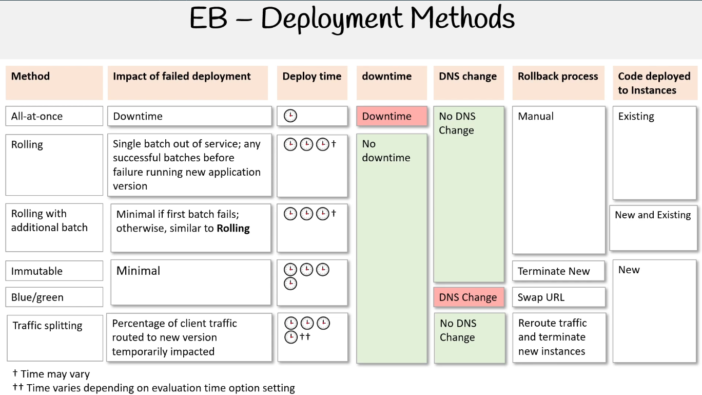
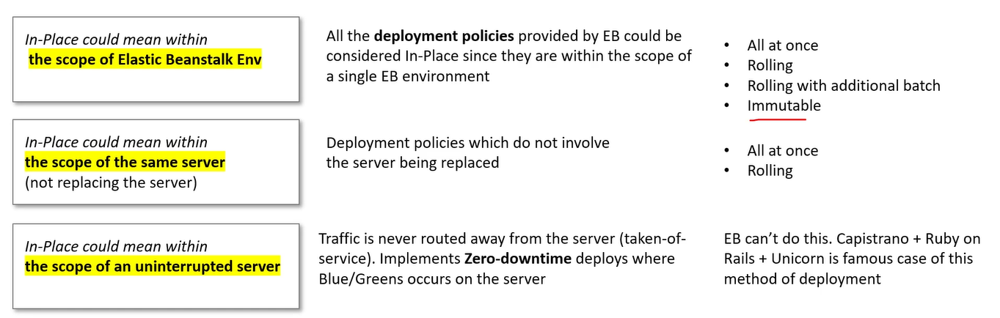
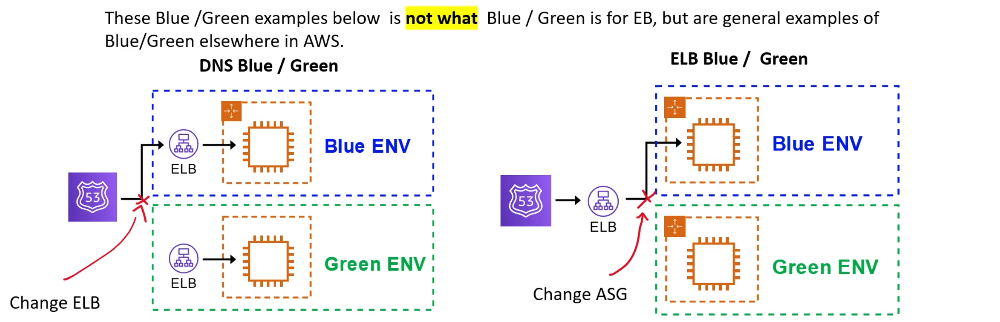

tags:: Elastic Beanstalk, Deployment Methods

-
- ### Overview
	- Configuring Deployment type in `deploy.config`
		- ```
		  # .ebextenstions/deploy.config
		  option_settings:
		    aws:elasticbeanstalk:command:
		    	DeploymentPolicy: 
		  ```
	- Availability for Web Environment Types Graphic:
	  collapsed:: true
		- {:height 138, :width 412}
	- Deployment Method Graphical Comparison:
	  collapsed:: true
		- 
			- [ref](https://app.exampro.co/student/material/dva-c02/6844)
			- Major impact on deploy time is provisioning new instances
- ### Deployment Policies
  id:: 6650b357-aab4-4dd6-9b45-1b9748220c0c
	- EB All at Once Deployment Policy #card
	  logseq.order-list-type:: number
	  load-balanced-env:: true
	  single-instance-env:: true
	  collapsed:: true
		- Defualt (fastest but most dangerous)
		- In case of failure, you must rollback by re-deploying the original version again to all instances
		- Process:
		  collapsed:: true
			- Deploys new app version to all instances at the same time
			  logseq.order-list-type:: number
			- Takes all instances out-of-service while the deployment processes
			  logseq.order-list-type:: number
			- Servers become available again
			  logseq.order-list-type:: number
	- EB Rolling Deployment Policy #card
	  logseq.order-list-type:: number
	  load-balanced-env:: true
	  single-instance-env:: false
	  collapsed:: true
		- Configuring:
			- ```yml
			  # .ebextenstions/deploy.config
			  option_settings:
			    aws:elasticbeanstalk:command:
			    	DeploymentPolicy: Rolling
			      BatchSizeType: Percentage
			      BatchSize: 25
			  ```
		- In case of Failure: Perform an additional rolling update in order to roll back changes
		- Process:
		  collapsed:: true
			- Deploys the new app version to a **batch** of instances at a time.
			  logseq.order-list-type:: number
			- Takes batch's instances **out of service** while the deployment processes.
			  logseq.order-list-type:: number
			- Reattaches updated instances.
			  logseq.order-list-type:: number
			- Goes onto next batch, taking them out of service.
			  logseq.order-list-type:: number
			- Reattaches those instances (rinse and repeat).
			  logseq.order-list-type:: number
		- Drawbacks:
		  collapsed:: true
			- Reduced capacity
	- EB Rolling with Additional Batch Deployment Policy #card
	  logseq.order-list-type:: number
	  load-balanced-env:: true
	  single-instance-env:: false
	  collapsed:: true
		- Pros/Cons:
		  collapsed:: true
			- Pro: Ensures capacity is never reduced.
			- Con: May cost more for additional instances
		- Configuring:
		  collapsed:: true
			- ```yml
			  # .ebextenstions/deploy.config
			  option_settings:
			    aws:elasticbeanstalk:command:
			    	DeploymentPolicy: RollingWithAdditionalBatch
			      BatchSizeType: Fixed
			      BatchSize: 5
			  ```
		- Process:
		  collapsed:: true
			- Launch new instance that will be used to replace a batch
			  logseq.order-list-type:: number
			- Deploy update app version to new batch
			  logseq.order-list-type:: number
			- Attach the new batch and terminate the existing batch
			  logseq.order-list-type:: number
		- In Case of Failure: Perform an additional rolling update to roll back the changes
	- EB Immutable Deployment Policy #card
	  logseq.order-list-type:: number
	  load-balanced-env:: true
	  single-instance-env:: true
	  collapsed:: true
		- **Blue/Green**
		- Configuring:
		  collapsed:: true
			- ```yml
			  # .ebextenstions/deploy.config
			  option_settings:
			    aws:elasticbeanstalk:command:
			    	DeploymentPolicy: Immutable
			      HealthCheckSuccessThreshold: Warning
			      IgnoreHealthCheck: true
			      Timeout: "600"
			  ```
		- Process:
		  collapsed:: true
			- Create a new ASG group with EC2 instances
			  logseq.order-list-type:: number
			- Deploy the updated version of the app on the new EC2 instances
			  logseq.order-list-type:: number
			- Test the new instances before redirecting traffic
			  logseq.order-list-type:: number
			- Point the ELB to the new ASG and delete the old ASG which will terminate the old EC2 instances
			  logseq.order-list-type:: number
		- Pros/Cons:
		  collapsed:: true
			- Pro: Safest way to deploy critical applications
			- Con: Deployments take longer
		- In case of failure: Just terminate the new instances since the existing instances still remain
	- EB Traffic Splitting Deployment Policy #card
	  logseq.order-list-type:: number
	  id:: 6650a8b9-f824-4c1d-9079-cdcad3e7af98
	  load-balanced-env:: true
	  single-instance-env:: false
		- Allows you to forward a portion of your traffic to the new environment and after a period of time, move the rest
		- Canary Deployment
		- Configuring:
			- ```yml
			  # .ebextenstions/deploy.config
			  option_settings:
			    aws:elasticbeanstalk:command:
			    	DeploymentPolicy: TrafficSplitting
			    aws:elasticbeanstalk:trafficsplitting:
			    	NewVersionPercent: "15"
			      EvaluationTime: "10"
			  ```
- ---
- [[img]], [[card]] In-Place Definition
  tags:: [[aws-3-associate]]
  collapsed:: true
	- All deployment polices could be considered in-place since they are within the scope of a single EB Environment
	- Other definitions
		- 
- #### Blue Green Deployment
	- https://app.exampro.co/student/material/dva-c02/6846?autoplay=true
	- EB Blue/Green Definition #card
	  collapsed:: true
		- Switching of ASG within our environment to the new set of EC2 instances so that rollbacks are easier to implement.
		- 
		-
-