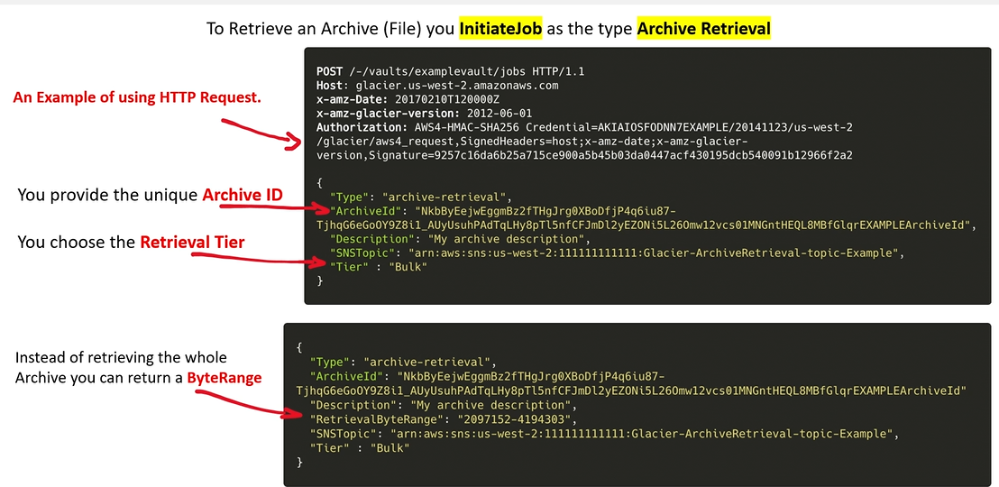

desc:: long-term durable and secure cold storage. long-term backup and data archiving.

- Extremely low-cost storage. months, years, decades
- Amazon S3 Glacier is serverless so you don't have to deal with capacity planning, data replication, hardware issues.
- Compliant under SOC, PCI DSS, FedRamp, HIPPA
- ## Design
	- Use Case/Architecture Example
	  collapsed:: true
		- 
		-
	- ### Operations
		- **Job Operations** can be triggered via AWS API, CLI, SDK, or Console and are performed on a S3 Glacier Vault. (for more on **List Jobs**, **Describe Job**, **Initiate Job**, and **Get Output Job**, see nested block)
		  collapsed:: true
			- 
		- To retrieve an Archive (file) you `InitiateJob` as the type `Archive Retrieval`
		  collapsed:: true
			- [[code-example]] | 
		- To retrieve only a portion of an Archive (file) to increase performance, you can use simple **SQL** expressions to pull **only the bytes you need** using Glacier `InitiateJob`/`Select`.
		  collapsed:: true
			- [[code-example]] | 
		- ---
		- **Uploading Archives**: Data can be moved directly to AWS servers via the Snow Family Hardware options, via S3 Lifecycle Policies (after 30 days) or using S3 Multipart Upload API.
		- **Deleting a Vault**: First delete all archives, then wait 24 hours until the Inventory says it is empty (no writes to vault since last inventory), must be deleted via the API, CLI, or SDK.
		- #### Locking a Vault
		  id:: 6887a784-48cb-4a9a-ab3f-cd87c464de03
		  collapsed:: true
			- **Step 1 - Initiate**: initiate by attaching a vault lock policy to your vault which will be set to `in-progress` and returns a `lock ID`. 24 hour window before lock ID expires
			- **Step 2 - Validate**: Use the `lock ID` to complete the lock process, if the policy does not work expected, you can abort the lock and restart.
		-
	- ### Security
	  id:: 688796e7-e6f7-495c-b781-d69f7e82824b
		- S3 Glacier is automatically server-side encrypted using AES-256. AWS then encrypts that key with a master key that is regularly updated.
		- Data-in-transit between S3 and S3 Glacier is encrypted via SSL when using lifecycle policies.
		- #### Vault Access and Lock Policy Structure
		  collapsed:: true
			- conditions can change based on actions.
			- 
			-
		- **Vault Access Policies** control `who` can access the vault. Only 1/vault.
		  collapsed:: true
			- can be edited at any time and can be done through the console.
			- require MFA to delete files
			- Don't let files delete for this period of time.
		- **Vault Lock Policies** prevent modification over a period of time, based on the policies conditions. Can assist in enforcing *regulatory and compliance requirements*.
		  collapsed:: true
			- Vault lock policies themselves can be locked via a WORM policy (once written, cannot be modified) via controls.
			- [Locking a Vault](((6887a784-48cb-4a9a-ab3f-cd87c464de03)))
		-
	- ### Monitoring
		- **Notification Configuration**: S3 Glacier supports a notification mechanism to notify you when a job is complete using Amazon SNS. There can only be one notification configuration per vault. The glacier stores the configuration as a JSON document (see nested block) at the URI `https://<region-specific-endpoint>/<account-id>/vaults/<vaultname>/notification-configuration`
		  collapsed:: true
			- ```json
			  {
			    "Topic": "arn:aws:sns:us-west-2:111122223333:mytopic",
			    "Events": ["ArchiveRetrievalCompleted", "InventoryRetrievalCompleted"]
			  }
			  ```
		- CloudWatch Alarms
		- CloudTrail Logs
		- AWS Trusted Advisor
		-
	- ### Cost
		- Cost Factors: Storage Total, Request Costs (number of requests, per GB retrieved)
		- #### Retrieval Time
			- How fast you want to retrieve archives significantly affects cost; broken down into tiers:
			- *Expedited Tier* (1-5 mins) | Urgent Requests
				- $0.03/GB retrieved
				- $10.00/1k requests
				- limited to 250MB archive size
				-
			- *Standard Tier* (3-5 hours) | Default
				- $0.01/GB retrieved
				- $0.05/1k requests
				- No archive size limit
				-
			- *Bulk Tier* (5-12 hours) | PB of data
				- $0.0025/GB retrieved
				- $0.025/1k requests
				- No archive size limit (PB of data)
				- tags:: ldh, qp2
				-
			-
		- #### Retrieval Policies
			- **No Retrieval Limit (default)**: No quota is set and all valid data retrieval requests are accepted.
			- **Free Tier Only**: Keep retrievals within daily free tier allowance.
			- **Max Retrieval Rate**: Control peak retrieval rate in bytes per hour.
			-
		- #### High Usage Factors
		  collapsed:: true
			- **S3 Glacier provisioned capacity**: Fixed per-month payment plan to save money for expedited retrievals. Each capacity unit costs $100/mo
			- Uploading many small archives can result in greater costs since metadata contributes to cost, so try to store large archives to reduce the metadata tax.
			-
		-
	- ### Data Model
		- Vault, Archive, Job
		- A **Vault**  is a container for storing archives that has an associated name and region with a unique address. i.e:
		  collapsed:: true
			- ```
			  https://<region-specific-endpoint>/<account-id>/vaults/<vaultname>
			  https://glacier.us-east-1.amazonaws.com/123456789/vaults/myvault
			  ```
		- An **Archive** is the base unit of storage which could be a photo, video, or document. Each archive has a unique ID. `https://<region-specific-endpoint>/<account-id>/vaults/<vaultname>/<arcive-id>`
		  collapsed:: true
			- For each Archive, 32 KB are added for index and related metadata
		- A ***Job*** can perform a `SELECT` query on archives, retrieve an archive, and/or get an inventory of a vault. Each job has a unique id at the URL: `https://<region-specific-endpoint>/<account-id>/vaults/<vaultname>/jobs/<job-id>`
		  collapsed:: true
			- **Inventory Retrieval**: Get an inventory of a vault. [Vault Inventory](((68879d5b-49f0-4a2b-8b42-13a3ea949e31)))
			- **Archive Retrieval**: Retrieve an archive (file)
				- To retrieve
			- **Select**: perform a select query on an archive
		- A **Vault Inventory** refers to the list of archives in a vault. There is no explore option via the console like S3, so a Vault Inventory must be generated, then individual requests for archives can be made.
		  id:: 68879d5b-49f0-4a2b-8b42-13a3ea949e31
		  collapsed:: true
			- After the first archive is uploaded to a vault, a vault inventory is automatically created and it takes *half a day to a full day* before that inventory is available for retrieval.
			- The vault inventory automatically updates once a day.
			- [[code-example]] | Retrieving a Vault Inventory | [[AWS-CLI]]
			  collapsed:: true
				- ```sh
				  # InitiateJob
				  aws glacier initiate-job \
				  --account-id <account-id> \
				  --vault-name my-vault \
				  --job-parameters file://job-archive-retrieval.json
				  # GetJobOutput
				  aws glacier get-job-output \
				  --account-id <account-id> \
				  --vault-name my-vault \
				  --job-id <job-id>
				  ```
		-
	-
-