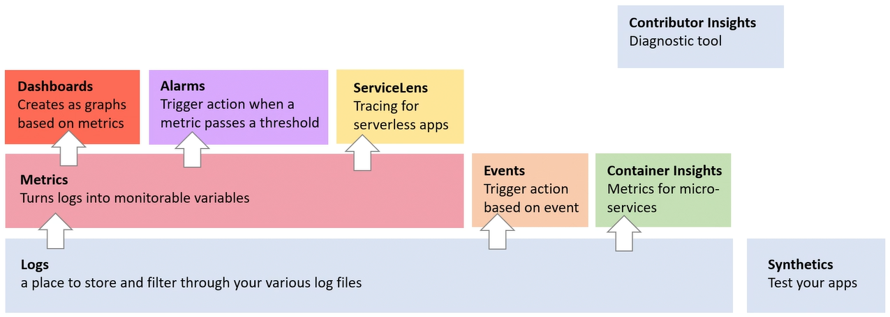

tags:: observability
desc:: monitoring solution, centralized log management service

-
- AWS CloudWatch is a **monitoring solution** for your AWS resources. CloudWatch is an umbrella service containing a collection of monitoring tools such as:
	- [[CloudWatch Logs]] - any custom log data, Application, NIGNX...
		- CloudWatch Logs is the foundation for many CloudWatch Services
			- 
	- CloudWatch Metrics - time-ordered set of data points.
	- CloudWatch Events - trigger an event based on a condition
	- CloudWatch Alarms - trigger notifications based on metrics that breach a defined threshold.
	- CloudWatch Dashboards - Creates visualizations based on metrics.
	- ---
	- collapsed:: true
	  
	  **ServiceLens**
		- Visualizes and analyzes the health, performance, and availability of your app in a single place.
	- collapsed:: true
	  
	  **Container Insights**
		- Collects, aggregates, and summarizes metrics and logs from your containerized apps and microservices.
	- collapsed:: true
	  
	  **Synthetics**
		- Tests your web apps to see if they're broken.
	- collapsed:: true
	  
	  **Contributor Insights**
		- Views the top contributors impacting the performance of your systems and applications in real-time.