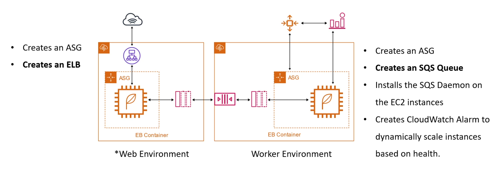

tags:: AWS-Compute
notes:: Not reccomended by Andrew Brown for anything

- Card:
  collapsed:: true
	- Elastic Beanstalk (EB) #card
	  tags:: Elastic Beanstalk, AWS-Provisioning, AWS-Containers, AWS-Serverless, PaaS
	  desc:: PaaS managed by AWS
	  use:: **Don't** (quickly deploy and manage web apps on AWS without worrying about underlying infrastructure)
	  collapsed:: true
		- **ECS** on training wheels, PaaS
		- Easily deploy containerized applications without setup or understanding AWS services
		  collapsed:: true
			- Typically more expensive because of that. .
		- Not recommended for production *enterprise* applications by AWS
		- Powered by CloudFormation templates
- ### Overview
	- #### Supported Frameworks:
	  collapsed:: true
		- Ruby | Rails
		- Python | Django
		- PHP | Laravel
		- Tomcat | Spring
		- Nod.js | Express
	- #### Supported Languages:
	  collapsed:: true
		- Go
		- Node.js
		- Java
		- Python
		- Ruby
		- PHP
		- ASP.NET
		- Docker
	- #### AWS Resources EB can Provision:
	  collapsed:: true
		- [Elastic Load Balancers]([[AWS-ELB]])
		- ((9b23d6bf-32af-469d-a835-e7dc46f23080))
		- ((c3576a24-f7c9-4c66-a9d2-ce9e171940b8))
		- ((23865347-0df5-4219-b714-d69bb13d8bb6))
		- Monitoring (CloudWatch, ((664760f1-3cd6-4d4c-85f3-c1220ba95149)))
		- In-Place and Blue/Green deployment methodologies
		- Security (Rotates Passwords)
		- Can run **[[docker]]ized** environments.
- ### Configurations
	- **Web vs Worker Environment**
	  collapsed:: true
		- Web: Web Application
			- Creates an ASG
			- **Creates an ELB**
			- Two Types:
				- Load-Balanced Env
					- Uses ASG and set to scale
					- Uses an ELB
					- Designed to Scale
				- Single-Instance Env
					- Uses an ASG but desired Capacity set to 1 to ensure server is running
					- No ELB to save on costs
					- Elastic IP Address $
		- Worker: Background Processes
		  collapsed:: true
			- Creates an ASG
			- **Creates an SQS Queue**
			- Installs the SQS Daemon on the EC2 instances
			- Creates CloudWatch Alarm to dynamically scale instances based on health
		- {:height 253, :width 717}
	- [[AWS EB-Deployment Policies]]
	- **Configuration Files**:
	  collapsed:: true
		- How elastic beanstalk environments can be customized
		- `.ebextensions/`: Folder at the project root which contains config files
		- `.config`: Extension for the config files store in `.ebextensions/`
		- Can config:
			- Option settings
			- Linux/Windows server configuration
			- Custom Resources
	- Environment manifest `env.yml`
	  collapsed:: true
		- Stored at project root directory
		- Allows you to configure defaults such as:
			- Name of environment
			- Stack solution
			- Associating the environment link
			- Default configuration of services
			- Environment groups
			- Makes your EB environment portable
			-
	- Deployment Policies
		- ((6650b357-aab4-4dd6-9b45-1b9748220c0c))
- Best to run in a single Docker Container
-
-